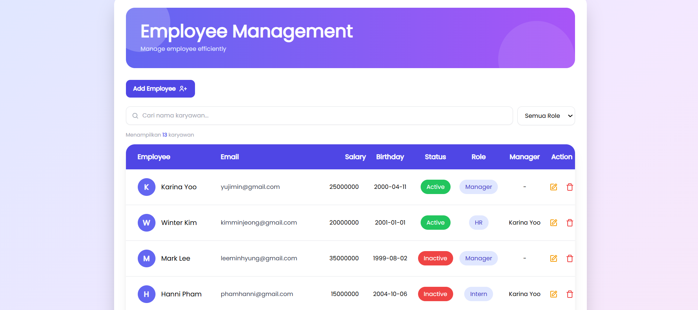

# 👥 Employee Management System

Aplikasi web untuk mengelola data karyawan secara efisien, dibangun dengan **Next.js** dan **MongoDB Atlas**, dilengkapi pipeline CI/CD otomatis via **GitHub Actions** dan deployment ke **Azure App Service**.

<div align="center">
  
</div>

> 🔗 **Live Demo:** [azure-pso-11-c-effafygdcdbnd4d5.koreacentral-01.azurewebsites.net](http://azure-pso-11-c-effafygdcdbnd4d5.koreacentral-01.azurewebsites.net)

---

## 🛠️ Tech Stack

| Kategori | Teknologi |
|---|---|
| Framework | Next.js (Node.js 22 LTS) |
| Database | MongoDB Atlas (Cosmos DB) |
| Testing | Jest, React Testing Library |
| CI/CD | GitHub Actions |
| Deployment | Azure App Service |

---

## ✨ Fitur

- ➕ Tambah data karyawan
- 📋 Lihat daftar semua karyawan
- ✏️ Edit data karyawan
- 🗑️ Hapus data karyawan
- 🔍 Cari karyawan berdasarkan nama
- 🏷️ Filter karyawan berdasarkan role
- 👤 Informasi role, status aktif/nonaktif, dan nama manager tiap karyawan

---

## 🔄 CI/CD Pipeline

Pipeline dibagi menjadi dua workflow terpisah:

### CI — Continuous Integration (`ci.yml`)
Berjalan otomatis pada setiap **push dan pull request** ke semua branch.
- Install dependencies (`npm ci`)
- Jalankan unit test beserta coverage report

### CD — Continuous Deployment (`cd.yml`)
Berjalan otomatis hanya pada **push ke branch `master`**.
- Install dependencies
- Build aplikasi Next.js (production mode)
- Buat deployment package
- Deploy ke **Azure App Service**

---

## 🧪 Testing

- **Jest** — unit test 5 fungsi CRUD (10 test case, skenario sukses & gagal)
- **React Testing Library** — test komponen UI
- **Coverage:** ~93% statements · 100% functions · ~92% lines

Jalankan test:
```bash
npm test
```

Jalankan test dengan coverage:
```bash
npm run test:coverage
```

---

## 🚀 Cara Run Lokal

### Prasyarat
- Node.js v22 LTS
- Akun [MongoDB Atlas](https://www.mongodb.com/products/platform/atlas-database)

### Langkah-langkah

1. **Clone repository**
```bash
   git clone https://github.com/antikarrr/azure-pso-11.git
   cd azure-pso-11
```

2. **Install dependencies**
```bash
   npm install
```

3. **Konfigurasi environment variable**

   Buat file `.env` di root project:
   MONGO_CONNECTION=<your_mongodb_connection_string>
   
4. **Jalankan aplikasi**
```bash
   npm run dev
```

5. Buka [http://localhost:3000](http://localhost:3000) di browser.

---

## 👨‍💻 Tim — Kelompok 11 PSO C

| Nama | NRP | Kontribusi |
|---|---|---|
| Antika Raya | 5026231034 | CI/CD Pipeline, GitHub Actions, GitHub Repository |
| Nabila Shinta Luthfia | 5026231038 | Azure Infrastructure, Deployment, Environment Config |
| Cindy Fatika Ekawati | 5026231039 | Testing (Jest & RTL), Coverage Report |

---

## 🙏 Acknowledgement

Proyek ini dikembangkan berdasarkan [NextJs_CRUD-with-MongoDB](https://github.com/NimeshPiyumantha/NextJs_CRUD-with-MongoDB) oleh [Nimesh Piyumantha](https://github.com/NimeshPiyumantha/).